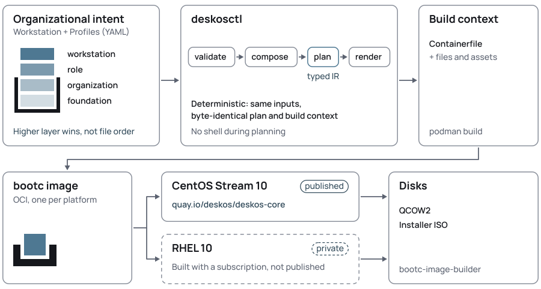
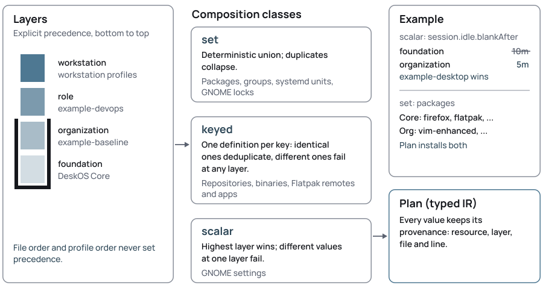

# DeskOS architecture

How DeskOS turns resources into a workstation image: the boundary it keeps,
the resource model, composition, the typed plan, the Containerfile
backend, and what has been validated on each platform.

**Contents:**
[Boundary](#boundary) ·
[Design principles](#design-principles) ·
[Resource model](#resource-model) ·
[Core, organizations and roles](#core-organizations-and-roles) ·
[Composition](#composition) ·
[Providers and the registry](#providers-and-the-registry) ·
[Plan (IR)](#plan-ir) ·
[Containerfile backend](#containerfile-backend) ·
[Public CentOS, private RHEL](#public-centos-private-rhel) ·
[Platform capability gaps](#platform-capability-gaps) ·
[Validation status](#validation-status) ·
[Supply-chain inputs](#supply-chain-inputs) ·
[Managed baseline](#managed-baseline) ·
[System Flatpaks](#system-flatpaks) ·
[GNOME](#gnome) ·
[Boot](#boot) ·
[Updates](#updates) ·
[Drift and mutable `/etc`](#drift-and-mutable-etc) ·
[Provisioning and enrollment](#provisioning-and-enrollment) ·
[Release model](#release-model)

## Boundary

DeskOS **compiles desired artifact state**. It does not continuously
reconcile deployed endpoint state.

<p align="center">
  <picture>
    <source media="(prefers-color-scheme: dark)" srcset="images/deskos-flow-dark.svg">
    
  </picture>
</p>

DeskOS is finished once the artifact exists. Keeping 4,000 running
machines in a given state is the job of configuration management
(Ansible Automation Platform, Satellite, Foreman, MDM); DeskOS builds the
*baseline* those systems operate on.

> [!NOTE]
> There is no controller, agent or reconciliation loop, and none is
> planned. Scheduled updates ([Updates](#updates)) are image content:
> timers that stage the next published image, not a loop that checks or
> enforces machine state.

## Design principles

- **Intent is data.**
- **Compilation is deterministic.**
- **File order does not define precedence.**
- **Providers emit typed IR**, not arbitrary shell.
- **DeskOS Core** provides capabilities and defaults; **organizations**
  provide policy and content.
- **DeskOS owns the artifact**, not the running machine.
- **CI is an adapter**, not the product.
- **AI may assist development**, but it is not part of compiler semantics.
- **Compose existing Linux technologies** rather than reinventing them.

## Resource model

Every resource is a versioned envelope:

```yaml
apiVersion: <group>.deskos.org/v1alpha1
kind: <Kind>
metadata: {name: <dns-label>}
spec: {...}
```

Identity is **GVK plus name** and must be unique across all loaded roots.
Resources are *plain data*: YAML anchors, aliases, merge keys and custom
tags are rejected, and no field accepts shell, templates or hooks.

| Group | Kinds |
|---|---|
| `core.deskos.org` | `Platform`, `Profile`, `Workstation` |
| `software.deskos.org` | `PackageSet`, `RpmRepository`, `BinaryArtifact`, `FlatpakRemote`, `FlatpakSet` |
| `desktop.deskos.org` | `GnomeProfile`, `Theme` |
| `system.deskos.org` | `BootProfile`, `UpdatePolicy`, `TrustAnchor` |

Schemas live in `schemas/` and are embedded in `deskosctl`. Each kind is
checked **twice**: against its JSON Schema, and by strict typed decoding
with semantic validation in its provider.

DeskOS Core is **embedded in `deskosctl`** — it is small and versioned with
the compiler — so a run loads it plus the resource roots you pass. Several
organization roots can be combined (`deskosctl plan ./one ./two ...`), and
an organization keeps its own repository of resources and references DeskOS
resources by name; it **never copies** them. `--no-core` drops the embedded
Core, and `deskosctl core export DIR` writes it for inspection.
Examples of every kind are in
[resources.md](resources.md).

## Core, organizations and roles

- **`Platform`**: facts about an OS target: bootc base image,
  redistribution constraints, the RPM groups behind DeskOS group names,
  GNOME integration facts (dconf database, default extensions, available
  extensions), boot facts, the units that update the image on their
  own, Flatpak capabilities, and CA trust-store facts. *All platform
  differences live here.*
- **`Profile`**: a reusable fragment of intent at a semantic layer. It
  lists the resources it includes.
- **`Workstation`**: a concrete build target, one Platform plus Profiles.
  It compiles into a workstation *image*; the kind names the machine you
  compose.

DeskOS Core (`resources/profiles/deskos-core.yaml`) is a `foundation`
profile. The same Core composes onto `centos-stream-10` and `rhel-10`; a
RHEL workstation starts from `registry.redhat.io/rhel10/rhel-bootc`,
**never** from the CentOS-based DeskOS image. A test asserts both
platforms produce the same Core content.

## Composition

<p align="center">
  <picture>
    <source media="(prefers-color-scheme: dark)" srcset="images/deskos-composition-dark.svg">
    
  </picture>
</p>

Layers: `foundation` < `organization` < `role` < `workstation`.

| Class | Used for | Rule |
|---|---|---|
| **set** | RPM packages, package groups, systemd units, GNOME locks | deterministic union; duplicates collapse |
| **keyed** | RPM repositories (by repo id), RPM files (by URL), binary destinations, desktop entries (by id), Flatpak remotes and applications, trust anchors (by name) | identical definitions deduplicate; different definitions conflict *at any layer* |
| **scalar** | GNOME, boot and update settings | highest layer wins; different values *at one layer* conflict |

**Profile order and file order never matter.** Every contribution carries
*provenance* (resource, including profile, layer, source file and line),
and conflict errors list every contributor.

References are transitive: a `PackageSet` names the `RpmRepository`
resources its packages need, a `FlatpakSet` names its `FlatpakRemote`.
Included resources contribute at the layer of the including profile.

## Providers and the registry

`internal/registry` maps GVK to a provider. A provider decodes and
validates one kind, may declare references, may contribute to
composition, and owns a lowerer that turns composed intent into Plan IR
using only Platform facts. **Providers have no side effects**: no
commands, no network. Asset reads are confined to the declaring resource
root.

Unknown kinds fail with
`no provider registered for <group/version>, Kind <Kind>`. The provider
contract (decode, references, contributions, IR) is data in and data out,
so a future out-of-process provider protocol can implement it.

## Plan (IR)

`internal/plan` is the typed intermediate representation, independent of
YAML and of Containerfile syntax. `deskosctl plan --format json` prints
it.

- **Artifact**: base image, labels, `RpmRepository`, `RpmGroupInstall`
  (with `excludePackages`), `RpmInstall`, `RpmFileInstall`, `VerifiedBinaryInstall`,
  `FileInstall`, `GeneratedFile`, `TrustAnchorInstall` (with `TrustStoreUpdate`),
  `DesktopEntry`, `IconCacheUpdate`, `DconfDatabase` (defaults and locks),
  `GSettingsVendorDefault`, `KernelArgument`, `InitramfsRegeneration`,
  `PlymouthTheme`, `SystemdEnable`, `SystemdMask`, `ScheduledUpdate`,
  `DefaultTarget`.
- **Provisioning**: system Flatpak remotes and applications, materialized
  on the machine by upstream `flatpak preinstall`.
- **Enrollment**: reserved and empty.

Every item keeps its provenance. The plan is **canonical**: sorted, no
maps, no timestamps.

## Containerfile backend

`internal/backends/containerfile` reads **only the Plan**. It renders:

```text
Containerfile
plan.json                 canonical Plan
generated-manifest.json   every file with mode and sha256
repos/etc/yum.repos.d/    one file per RpmRepository
rpm-keys/                 public keys of RPM files, named by sha256
rootfs/                   image files, copied after package installation
```

The Containerfile, in order:

1. one group transaction, with the platform's `--exclude` options;
2. copies repository files and runs one package transaction;
3. copies `rpm-keys/` to `/usr/share/deskos/rpm-keys/`, then, in one RUN,
   downloads every RPM file, checks its SHA-256, checks its signature
   against its own key in a temporary rpm keyring (an unsigned package or
   another key fails the build), and installs them in one package
   transaction; the image's rpm keyring is not changed;
4. one verified download per binary artifact;
5. copies `rootfs/`;
6. checks the DeskOS GSettings override with
   `glib-compile-schemas --strict` against the installed schemas, then
   compiles them without `--strict`, as the packages do;
7. runs `dconf update`, regenerates the hicolor icon cache when the
   image installs desktop entry icons, regenerates the platform trust
   store when the image places trust anchors, enables and masks units and
   sets the default target;
8. installs the Plymouth theme and rebuilds the initramfs when boot intent
   needs them (see [Boot](#boot));
9. cleans package caches and ends with `bootc container lint`.

Every generated command comes from a typed operation; values are
validated upstream and quoted again. The plan is also installed as
`/usr/share/deskos/plan.json`, so a future endpoint tool can report what
the image was built from.

**Rendering never needs credentials or network.** Building RHEL contexts
needs an entitled build host, which is a factory input.

### Build-host subscription state

On EL10 the subscription-manager dnf plugins run inside every `dnf`
transaction of a build. On an entitled host they write `redhat.repo`
(pointing at the host's entitlement certificate serial) and state under
`/var/lib/rhsm` and `/var/log/rhsm`. So every RPM transaction the backend
emits:

- mounts those two directories as **tmpfs**;
- removes the generated `/etc/yum.repos.d/redhat.repo` **in the same
  RUN**, before the layer is committed (removing it in a later layer would
  leave it in the image history);
- fails if a `redhat.repo` already exists, and the render rejects an
  `RpmRepository` with id `redhat`, so declared content is never removed.

subscription-manager's own tmpfiles.d entries recreate `/var/lib/rhsm`
and `/var/log/rhsm` at boot.

### Lint warnings

`bootc container lint` passes with **three warnings**, all produced by
distribution package scriptlets rather than by DeskOS:

- content in `/run` (cockpit, cups);
- users without sysusers.d entries (libstoragemgmt, wsdd; on RHEL also
  avahi and libvirtdbus);
- `/var` content without tmpfiles.d entries.

Seen on CS10 Core builds `50f8892a` and `77832d5c` (11 passed, 1 skipped)
and the RHEL 10.2 builds `81bdfeec` and `0e65bf4b` (10 passed, 1
skipped), where the RHSM tmpfs mounts keep `/var/log/rhsm/rhsm.log` out of
the image. They are non-blocking. Whether to seek upstream fixes, declare
exceptions or use `--fatal-warnings` is a release decision; DeskOS does
not alter package behavior to silence them.

## Public CentOS, private RHEL

The public reference workstation `deskos-core-centos10` is
redistributable and is the source of `quay.io/deskos/deskos-core`.

> [!IMPORTANT]
> RHEL-derived images are covered by the RHEL EULA and are **never
> published**. The `rhel-10` Platform marks them
> `redistributable: false`, and plans and Containerfiles carry that
> notice. Subscription material never appears in resources.

## Platform capability gaps

Organizational intent can ask for something a platform does not supply.
The Platform lists such packages under `unavailablePackages` with a
reason, and **composition fails with that reason** instead of dropping or
substituting the package. The example organization shows this with
`virt-manager`, which EL10 ships only in the CodeReady Linux Builder
repository (unsupported on RHEL 10); see
[`examples/baseline-and-role/README.md`](../examples/baseline-and-role/README.md).

A Platform package group may list `excludePackages`: group members the
platform does not install with the group. They become `--exclude` options
of the single group transaction only, so a `PackageSet` that names one
still installs it. The CS10 Platform excludes setroubleshoot this way; see
[research-notes.md](research-notes.md). The RHEL 10 Platform excludes
`redhat-flatpak-preinstall-firefox`: its Firefox Flatpak comes from an
OCI remote whose authenticator needs a session bus, so a system
`flatpak preinstall` fails for every declared Flatpak. Core installs the
Firefox RPM on both platforms.

## Validation status

| Claim | CentOS Stream 10 | RHEL 10 |
|---|---|---|
| Core and the example organization compose and render | **validated** | **validated** |
| Same Core content on both platforms | **validated** (test) | **validated** (test) |
| Image builds, `bootc container lint` passes | **validated** (CI) | **validated** on the factory host [^rhel-build] |
| Packages install from the declared sources | **validated** | **validated** (package presence; only Firefox launched) |
| Build layers free of build-host identity | not rechecked since the fix | **validated**: 0 findings in all layers [^layers] |
| Boots to GNOME with DeskOS defaults | **validated** [^cs10-boot] | **validated** on the factory host [^rhel-boot] |
| Automated runs | `supply-chain.yml` (manual): builds, scans, boots, then publishes and signs | `tests/rhel/factory.py`, every head of `main`, as the `deskos/rhel10` commit status |
| Failed system units in the session check | none except `mcelog.service` in AMD QEMU guests [^mcelog] | same as CentOS Stream 10 |
| Flatpak preinstall materializes apps | remote and ref resolution checked | system preinstall installs Flathub apps [^flatpak] |

[^rhel-build]: Image `0e65bf4b` on RHEL 10.2, base `d13af792...`; lint
passed with the three known warnings.
[^layers]: All 75 layers of `0e65bf4b` scanned for RHSM paths and the
build host's entitlement serial, consumer UUID and hostname.
[^cs10-boot]: `bootcheck.py` on Core disks (pixel classes; frames show the
DeskOS splash and GNOME Initial Setup over the DeskOS wallpaper);
`sessioncheck.py` confirms Dash to Dock active, favorites and wallpaper
as planned and Firefox running headless; the GDM login logo was seen in a
Core VM. No full E2E.
[^rhel-boot]: Same checks on the `0e65bf4b` disk, under nested KVM on the
entitled factory VM (example wallpaper); not in CI; no full E2E.
[^cs10-run]: Last run `37162282876` on commit `8ab0cc9`, with the approved
DeskOS identity; it published `quay.io/deskos/deskos-core:8ab0cc9...` and
`:latest`.
[^mcelog]: In AMD QEMU guests without `edac_mce_amd`; reported as a known,
non-blocking diagnostic with its raw failed state (see
`tests/vm/README.md` and [research-notes.md](research-notes.md)).
[^flatpak]: `example-devops-rhel10` declares no Flatpaks. A private RHEL
10.2 workstation with four Flathub apps: `flatpak preinstall --system`
without a session bus installed all four from `/usr/share/flatpak/preinstall.d`
in the built image, and its booted disk had no failed preinstall unit.

Confirmed on RHEL 10.2 by that build: `workstation-product-environment`,
`gnome-shell-extension-dash-to-dock` 102, Terraform 1.16.5, kubectl
1.37.1, VS Code 1.140.0 and Chrome 154 from their vendor repositories,
and the rhel9 `oc` 4.22.14 build (needs at most GLIBC_2.34).

**Still open:** E2E tests on either platform.

## Supply-chain inputs

**Compilation is deterministic; builds are not yet reproducible bit for
bit.** External inputs that can still change between builds:

- the base image tag, unless `bootc.digest` is set (CentOS Stream 10 and
  RHEL 10 pin their x86_64 manifests);
- RPM repository metadata and packages.

`BinaryArtifact` pins an exact version and SHA-256; RPM files pin a
SHA-256 and a signing key; and **RPM repository signing keys are local
assets**, read into the plan and placed in the image, so a dnf transaction
never trusts a key fetched by URL. The remaining goal is that every
external input has an immutable, verifiable identity; candidate mechanisms
(lockfile entries, base digests) are not chosen yet.

## Managed baseline

DeskOS manages what the organization requires **for any authorized user
of the machine**, available before any user's `$HOME` exists. Personal
and project tooling (Homebrew, mise, SDKMAN, language version managers,
dotfiles, personal Toolboxes) stays outside the resource model.

Acquisition order:

1. distribution RPM;
2. official vendor RPM repository;
   - 2b. signed vendor RPM file, when the vendor publishes no repository:
     it is still a vendor-signed RPM managed by the package manager, but
     updates need a new URL and checksum in the resources;
3. checksum-pinned upstream binary;
4. system Flatpak;
5. in the future, managed web applications.

`BinaryArtifact` requires an exact version, an https URL that is not a
floating location, a SHA-256 checksum, and installs only directly into
`/usr/local/bin` with mode `0755` or `0555`.

A single-file `BinaryArtifact` may declare a `desktopEntry`. The
software lowerer turns it into a `DesktopEntry`, a `FileInstall` for its
icon and an `IconCacheUpdate` for `/usr/share/icons/hicolor`, and adds
the `gtk-update-icon-cache` package. The backend generates
`/usr/share/applications/<id>.desktop` in `rootfs/`; its `Exec` and
`TryExec` are the artifact's destination, never authored text. The icon
cache is regenerated after `rootfs/` is copied because RPM file triggers
maintain it only for packaged files, and GTK keeps using an existing
cache that lacks the copied icons.

`PackageSet.rpmFiles` requires the same kind of URL and checksum plus an
ASCII-armored public key file inside the resource root; the build fails
unless the RPM is signed by that key.

## System Flatpaks

DeskOS is **image-first and Flatpak-enabled**. Core installs Flatpak; it
does not add a remote. Remotes go to `/usr/share/flatpak/remotes.d` and
applications to `/usr/share/flatpak/preinstall.d`, both image-owned. A
generated unit runs `flatpak preinstall` once per boot, as the upstream
man page expects the OS to do. This is *artifact materialization*, not a
DeskOS controller: upstream decides what to install or remove from the
image's vendor list, and does not reinstall apps a user removed.

The unit is `WantedBy=multi-user.target`, `Type=exec`, and ordered after
`network-online.target` and `multi-user.target`. Ordering it after
`multi-user.target` suppresses the implicit `After=` a target adds to
units it wants (systemd v257 `unit_add_default_target_dependency`), so
**DeskOS adds no network wait to any boot target**; `Type=exec` means
nothing waits for the download itself. It does not restart.

Offline boot, observed by booting the reference image under systemd in a
container with no network and a 25-second simulated `nm-online` timeout:

- `gdm.service` is not ordered after the network, `multi-user.target` or
  this unit, and was active while `network-online.target` was still
  pending.
- `graphical.target` still waits for `network-online.target`, because
  platform units (`kdump`, `rsyslog`, `insights-client-boot`) are wanted
  by `multi-user.target` and ordered after it; on EL10 that wait is
  bounded by `NM_ONLINE_TIMEOUT=60`. That is platform behavior, not
  DeskOS behavior.
- Without network, `flatpak preinstall` prints "Nothing to do.", exits 0
  and records nothing, so the apps stay eligible: a later run with
  network proposed the install again (it was declined in the test, so an
  actual installation after an offline boot is unverified). A download
  failure is expected to exit non-zero and leave the unit failed, visible
  in `systemctl status deskos-flatpak-preinstall` and the journal; this
  was not tested.

GDM itself was not exercised in the container (it has no display) and a
real offline VM boot has not been run. The public reference adds Flathub
and Bazaar through the separate `deskos-reference-apps` profile.

## GNOME

`GnomeProfile` exposes **administrator vocabulary** (`windows.buttons`,
`shell.favorites`, `session.idle.blankAfter`, `dock.position`, ...). The
desktop lowerer maps it to dconf keys and writes them to the platform's
vendor database (`distro` on EL10). Wallpaper files are repository assets
resolved relative to the declaring file and installed under
`/usr/share/deskos/backgrounds/`.

**Dock.** Dock settings apply only while the effective `dock.enabled` is
true. A higher-layer `dock.enabled: false` masks lower-layer dock options
and is reported as a warning by `plan` and `validate`; dock options
without an enabled dock, or at or above the disabling layer, are errors.
A disable writes `enabled-extensions` without the dock only when the
platform enables it by default or `dock.enabled` is locked. Core sets
only `dock.enabled: true` (the extension's defaults); an organization's
`dock.enabled: false` removes the package and the extension entry.
Favorites are native and work without the dock.

**Appearance.** `appearance.colorScheme` and `appearance.accentColor` set
`org.gnome.desktop.interface` `color-scheme` and `accent-color`, with the
enum values of `gsettings-desktop-schemas` 47.1. Core sets neither.

**GNOME Software.** `software.updates` controls the updates GNOME Software
handles, Flatpak applications included:

| Value | `allow-updates` | `download-updates` | Effect |
|---|---|---|---|
| `automatic` | true | true | GNOME default: downloads in the background and applies what needs no reboot |
| `manual` | true | false | offers updates; the user applies them |
| `disabled` | false | false | no Updates page; another updater owns every update |

Core sets `manual` (a default, no lock), so GNOME Software never updates
behind the image while users can still update Flatpak applications.

**Terminal shortcut.** `GnomeProfile.defaults.keyboard.terminal` names a
`.desktop` id bound to Ctrl+Alt+T (EL10 has no native terminal key and no
default-terminal launcher outside EPEL). **Not modeled:** the
AppIndicator extension is packaged only in EPEL, so no Platform declares
it; GNOME Initial Setup shows its third-party repositories page only
when `fedora-third-party` is installed, which EL10 does not ship. See
[research notes](research-notes.md#gnome-user-settings-2026-10-04).

**Login screen.** `appearance.loginLogo` sets the GDM login-screen logo;
GDM's dconf profile reads `distro`, which Platforms declare with
`gnome.loginScreen`.

**First boot.** GNOME Initial Setup uses its own dconf profile, which does
not read `distro`, so the effective wallpaper is also written as a GLib
vendor override (`/usr/share/glib-2.0/schemas/50_deskos.gschema.override`,
above the distribution's `10_` override) and schemas are compiled in the
build. Verified by GSettings resolution under the `gnome-initial-setup`
profile and seen on the first-boot screen of a CS10 Core VM.

**Defaults and locks.** The EL10 profile reads `user`, `local`, `site`,
`distro`, highest first. Verified on the built image:

| DeskOS writes | Effect |
|---|---|
| a **default** | a value in `local` or `site`, or a user change, overrides it |
| a **lock** | the `distro` value applies and is not writable; values and even locks in `local` or `site` are ignored |

> [!WARNING]
> A lock is artifact-level enforcement that also defeats `site` and
> `local` overrides. DeskOS Core uses no locks. Lock only settings the
> organization wants the *image* to enforce, and leave settings managed by
> Ansible, Satellite or similar tools as defaults (or unset).

## Boot

`BootProfile` (`splash: graphical|text`, `quiet`, `watermark`) lowers to:

- bootc kernel arguments in `/usr/lib/bootc/kargs.d/50-deskos.toml` (the
  platform's `rhgb` and `quiet`);
- for `graphical`: the platform's Plymouth packages, a dracut drop-in
  adding the Plymouth module, and a rebuild of every image kernel's
  initramfs (`/usr/lib/modules/<kver>/initramfs.img`) after the image
  files are in place. **The build fails** if no kernel is found or
  Plymouth is missing from an initramfs.

`text` adds no splash argument and no rebuild; `quiet: false` adds no
`quiet`. bootc applies kargs.d at install and applies its diff on
updates; the initramfs is image content, so updates and rollbacks carry
it with the deployment.

**Watermark.** `watermark` (a PNG, at most 1024x1024, inside the resource
root) needs an effective `splash: graphical`. It becomes an image-owned
two-step theme `deskos` in `/usr/share/plymouth/themes/deskos/`:

- a generated `deskos.plymouth` (the stock spinner layout, own
  `ImageDir`, no firmware BGRT logo);
- the watermark as `watermark.png`;
- the platform's stock spinner frames copied in the build, except their
  `watermark.png`.

`plymouth-set-default-theme deskos` selects it before the initramfs
rebuild, and the build fails unless each initramfs contains the theme and
selects it. A higher-layer `splash: text` masks a lower-layer watermark
with a plan warning; a watermark at or above a `text` layer, or with no
splash set, is an error. Core sets the DeskOS lockup; without a watermark
the platform's default theme stays.

**Diagnostics stay available:** ESC switches Plymouth to details, systemd
still prints failures under `quiet`, and editing the boot entry to drop
`rhgb quiet` gives full text. Firmware, bootloader and early kernel output
before Plymouth starts can still appear. The DeskOS splash is seen at boot
and shutdown on UEFI VMs. A serial console turns Plymouth to text mode, so
test QCOW2s are built with bootc-image-builder's
`--no-default-kernel-args`, which omits its `console=ttyS0` (see
`tests/vm/README.md`); the artifact's own kernel arguments are unchanged.

## Trust store

`TrustAnchor` (`anchors[].name`, `anchors[].file`) places organization CA
certificates in the platform trust store. It lowers to:

- one image file per anchor at `<trust.anchorsDir>/<name>.crt`;
- one trust-store update through the platform's `trust.updateCommand`,
  run in the system-configuration step after `COPY rootfs/`.

On `rhel-10` and `centos-stream-10` the anchors directory is
`/etc/pki/ca-trust/source/anchors/` and the command is `update-ca-trust`,
which regenerates `/etc/pki/ca-trust/extracted/`. The update runs during
the build, so the extracted store is image content and changes only when
the anchors change.

Each anchor is a **keyed** definition by `name`: identical definitions
deduplicate and different certificates under one name conflict at any
layer. The certificate must be a PEM `CERTIFICATE` block that parses as
X.509; the private key is neither needed nor accepted. A platform without
`trust` facts fails composition when a `TrustAnchor` is used.

The destination is never replaced silently: the render rejects an anchor
that shares a path with another image file, and the build fails if the
base image or an installed package already provides that exact file. Asset
paths are confined to the resource root, so `../` cannot pull a host file
into the build context and a symlink out of the root is refused too.

## Updates

Both base images enable `bootc-fetch-apply-updates.timer` (a
`default.target.wants` link in `/usr/lib` that `systemctl disable` does
not remove). Its service runs `bootc upgrade --apply`, which **reboots**
whenever a new image is published.

`UpdatePolicy` (`image` and `flatpak`, each with `automatic`,
`schedule: daily|weekly` and `requireACPower`) lowers to:

- for any `image.automatic`: masks of the Platform's
  `updates.imageUpdateUnits` (`systemctl mask`, links to `/dev/null` in
  `/etc/systemd/system`);
- for `automatic: true`: a generated service and an enabled timer in
  `/usr/lib/systemd/system/`:

| Unit | Command |
|---|---|
| `deskos-image-update.service` | `/usr/bin/bootc upgrade --quiet` |
| `deskos-flatpak-update.service` | `/usr/bin/flatpak update --system --noninteractive --assumeyes` |

`bootc upgrade` without `--apply` downloads the image and stages it;
`ostree-finalize-staged.service` applies it at the next shutdown or
reboot the user makes. **No generated unit reboots**, and a test rejects
`--apply`, `--soft-reboot` and `--download-only` in any rendered file.

Timers use `OnCalendar=daily` or `weekly`, `RandomizedDelaySec=2h` and
`Persistent=true` (a missed run starts after the next boot).
`requireACPower` adds `ConditionACPower=true` to the service: on battery
the run is skipped, not failed, until the next scheduled time. Desktops
and VMs without a known AC connector count as on AC power. Services want
and follow `network-online.target`; the timers add no boot ordering.

Core sets image and Flatpak updates daily, on AC power only. An
organization overrides single fields at a higher layer; `automatic:
false` for the image keeps the platform updater masked and schedules
nothing, leaving updates to an administrator or configuration
management. A workstation with no image intent keeps the platform's
rebooting timer. The masks live in `/etc`, so a local unmask is kept
across image updates (see [Drift](#drift-and-mutable-etc)).

**Not supported:** metered networks (systemd has no condition for them,
and reading NetworkManager's `Metered` property needs a program, which
would be a script); a catch-up run when AC power returns. Checked:
`systemd-analyze verify` of the Core units, and a CentOS Stream 10 VM
installed from a registry image: `deskos-image-update.service` staged
the next image with the same boot ID, a manual reboot booted it with the
previous image as rollback, the bootc timer stayed masked, and
`deskos-flatpak-update.service` succeeded. Not yet checked: RHEL 10, and
a laptop running on battery.

## Drift and mutable `/etc`

bootc updates `/usr` atomically, but **`/etc` is persistent and merged
three ways**. Files DeskOS writes under `/etc` (dconf keyfiles, repository
files) follow image updates only while they are locally unmodified. A new
release changes the image; it does not force a machine that was edited
locally back into line. Organizations that need guaranteed enforcement use
configuration management on top of the image. A future `deskos status` or
`deskos diff` may *report* drift; DeskOS will not enforce.

## Provisioning and enrollment

| Stage | Contents |
|---|---|
| **Artifact** | everything identical across machines: packages, branding, client binaries, descriptors |
| **Provisioning** | per-machine install choices, a local bootstrap account, storage and encryption, first-boot Flatpak materialization |
| **Enrollment** | FreeIPA or AD join, device certificates, VPN identities, EDR tenancy |

One image digest serves many machines with distinct identities, so **no
identity or secret is ever baked into the artifact**. Enrollment is
reserved in the Plan and not implemented.

## Release model

The **OCI image is the primary artifact**; QCOW2 and ISO derive from it.

- **Published today:** the CentOS Stream 10 image on
  `quay.io/deskos/deskos-core`. Publishing is manual: the `supply-chain`
  workflow (with `publish=true`) builds, scans, boots, then pushes and
  signs `:latest` and `:<commit>` together. It is not published on every
  green `main`; pin a digest in production.
- **Not yet published:** QCOW2 and ISO, to go on S3-compatible object
  storage, not on GitHub; until then they are built locally (see
  [install.md](install.md)). The CI builds QCOW2 disks only as test input.
- **Planned:** promote the same digest through channels (candidate,
  canary, pilot, stable) without rebuilding. A mirror on
  `ghcr.io/deskosproject/deskos-core` is possible and not decided.

`deskosctl` itself is released as a linux/amd64 binary on GitHub Releases
when a `vX.Y.Z` tag is pushed. GitHub Actions is the reference CI; it is
an adapter, not part of DeskOS semantics.
